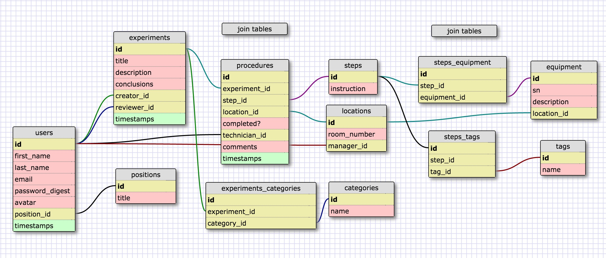

# diatomic
A simple app in Rails and JavaScript for creating digital lab notes.

[schema](#schema) | [models](#models) | [goals](#goals) | [user stories](#user stories)

## App Design

### Schema

[Schema XML](db_schema.xml)

### Models
User
  - has_many created_experiments
  - has_many reviewed_experiments
  - has_many completed_experiment_steps
  - has_many rooms_managed
  - belongs_to position

Position
  - has_many staff

Experiment
  - has_many procedures
    - has_many steps, through procedures
    - has_many locations, through procedures
  - has and belongs to many categories
  - belongs to creator
  - belongs to reviewer

Procedure
  - join table between Experiment and
  - belongs to experiment
  - belongs to step
  - belongs to technician who completed the work

Step
  - has_many steps_equipment
    - has_many used_equipment, through steps_equipment
  - has and belongs to many tags
  - has many procedures

StepEquipment
  - join table between equipment and step
  - belongs to equipment
  - belongs to step

Location
  - has_many equipment
  - belongs to room manager

Category
  - has and belongs to many experiments

Tag
  - has and belongs to many steps

Equipment
  - belongs to location
  - has many steps_equipment

### Stretch Goals
- Experiment Templates, with pre-defined sets of procedures that are created when a template is chosen (creates new experiment, creates new procedures with existing steps)
- Permissions related to Position, with Admin all access, Primary Invesigator with experiment/reviewer access - not too sure about this
- Steps include time started and time ended

## User Stories
1. As an experiment creator, I want to:
  - Create a new experiment
  - Add steps to my experiments through procedures
  - Add information to my experiment through description and conclusions
  - Have my experiment reviewed
  - Add categories to my experiments
  - See my experiments
  - See other's experiments
2. As a reviewer, I want to:
  - See a completed experiment
  - Once I have read the experiment, "sign" that I have reviewed it
  - See a list of experiments I have reviewed
3. As a technician, I want to:
  - Add steps to an experiment I'm working on
  - Add comments to steps that I'm working on
  - Add equipment to steps that I'm working on
  - Record what room I did the work in
  - Mark that a step has been completed
  - "Sign" that I was the user that completed a step
  - See procedures I've completed
4. As a scientist (creator or technician), I want to be able to:
  - Create new steps
  - Add tags to steps
  - Add equipment to steps
  - See steps already created
5. As a lab manager, I want to:
  - Be assigned to a room to manage
  - Add/remove/edit equipment assigned to my room
  - See a list of equipment assigned to my room
